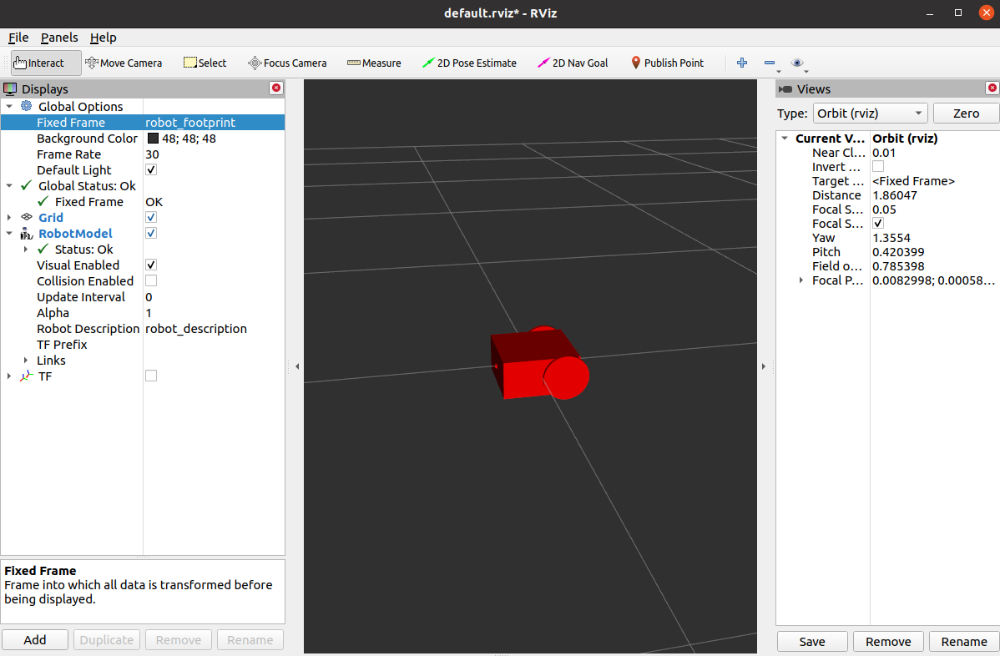
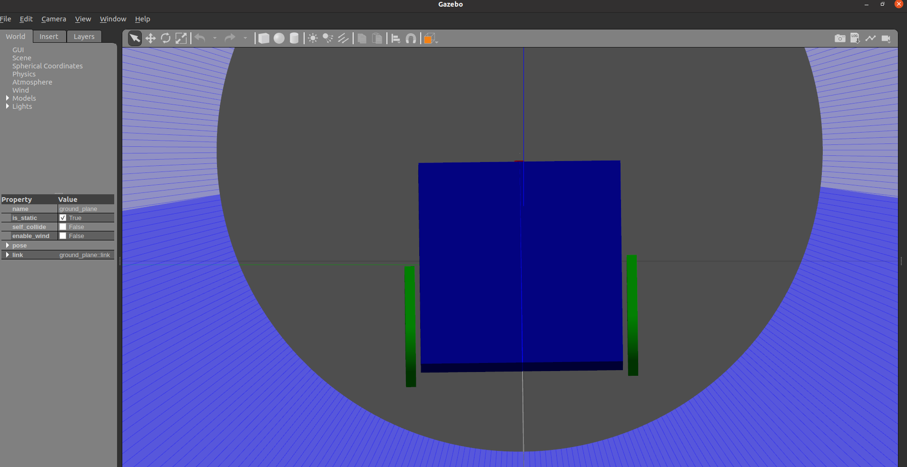

# ogmen-question
Solution of the problem statement given by ogmen robotics.


## Question 1
#### For visualising robotModel in Rviz:
```
 roslaunch bot_description control.launch
 ```

- 

#### For visualising robotModel in Gazebo:
```
 roslaunch bot_description spawn.launch
 ```

- 


##### (still under update)
